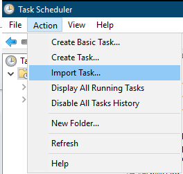
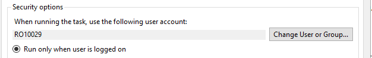
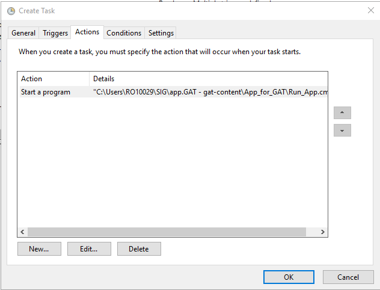

# appGAT client script

Partner script for GAT application handling clint side processes.

## Getting Started

This script uses the .NET FileSystemWatcher class to monitor file events in the users Downloads folder.
Upon finding the required file(s) it will move it to the SPO synced folder and open it/them.

### Contents

The package contains 3 files:
* `appGAT.ps1` - This is the actual script
* `appGat.xml` - This is the xml file used to create the scheduled task
* `Run_app.cmd` - this is a batch command to run the script with the correct parameters.
> `Powershell` scripts don't run correctly "as-is" from task scheduler. In order to ensure the proper functionality of the script we run it through the following command:
> ```powershell 
> PowerShell.exe -WindowStyle Hidden -NoExit -ExecutionPolicy Bypass -File "%userprofile%\app.GAT - gat-content\App_for_GAT\appGAT.ps1"
> ``` 

### Prerequisites

The execution policy for `PowerShell` scripts to `Bypass`
 ```powershell 
 Set-ExecutionPolicy -ExecutionPolicy Bypass
  ```

### Instalation
* Edit the `run_app.cmd` file to correctly show the actual location of the script (Only required if the script is stored in a non-default location)

* Import the `appGat.xml` File in ***Task Scheduler*** (Only required if task did not import correctly)
> - 
> - Select the `appGat.xml` file from the package
> - Select `Change User of Group`
> - 
> - Add own Username
> - Go to Actions
> - 
> - Hit *Edit*
> - 
> - Select **Browse**
> - Select the `run_app.cmd` file
> - Confirm changes and exit


### Usage

The script will now start with every user logon and will stop at logoff. 
The powershell console will be hidded to prevent user interaction and errors.

## Built With

* [PowerShell 4.0](https://docs.microsoft.com/en-us/powershell/module/../../../../../Readme/action.pngmicrosoft.powershell.utility/?view=powershell-6)
* [VisualStudio Code](https://code.visualstudio.com/)

## Versioning

Out of Scope for the moment

## Additional information

* [Register-ObjectEvent](https://docs.microsoft.com/en-us/powershell/module/microsoft.powershell.utility/register-objectevent?view=powershell-6)