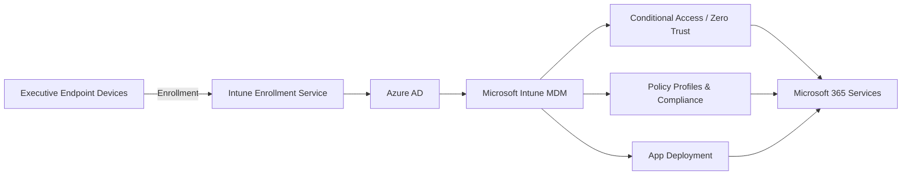
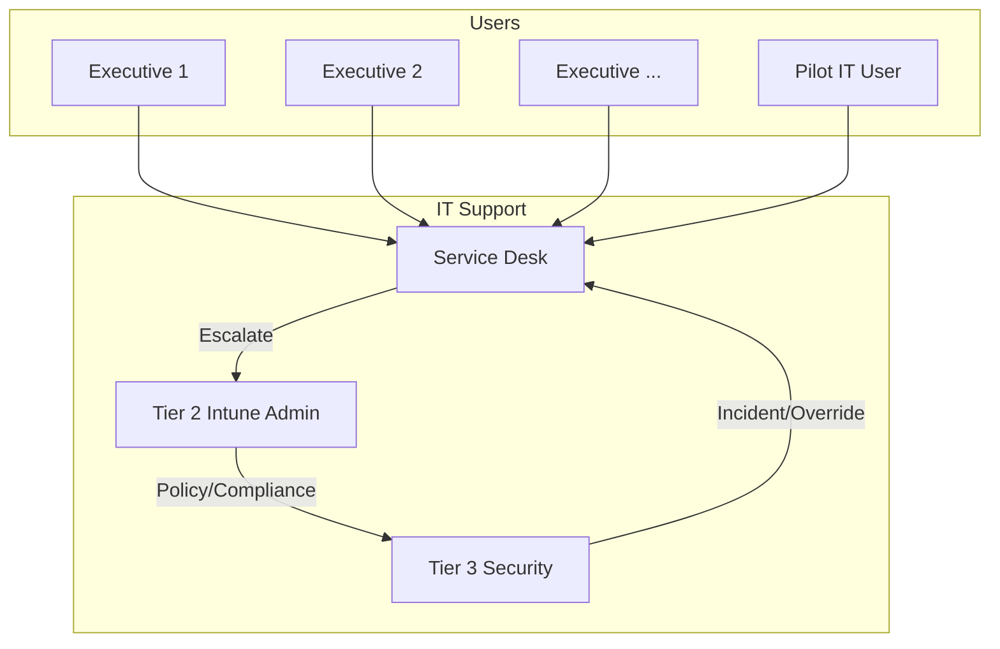

# Intune Implementation Plan for Executive Committee

##### Microsoft Intune Executive Rollout: Implementation Plan

---

#### Executive Summary

The following implementation plan serves as a **comprehensive, step-by-step guide** for deploying Microsoft Intune , starting with a pilot followed by executive users. The rollout is meticulously architected with security, scalability, and operational excellence at its core. The initial focus is a  **pilot involving a small cadre of IT staff** followed by **executive committee members (15–20 users)** , ensuring alignment with both executive needs and best-in-class security practices. This document details  **recommended Intune policy settings for executives, Role-Based Access Control (RBAC), advanced Conditional Access workflows, custom device compliance, onboarding/support documentation, communication planning, and robust monitoring/reporting** . Visual architectural diagrams are included in Mermaid syntax for in-situ documentation. The end goal is a secure, auditable, and scalable Intune deployment, primed for future enterprise-wide expansion.

---

## Table of Contents

- [Intune Implementation Plan for Executive Committee](#intune-implementation-plan-for-executive-committee)
        - [Microsoft Intune Executive Rollout: Implementation Plan](#microsoft-intune-executive-rollout-implementation-plan)
      - [Executive Summary](#executive-summary)
  - [Table of Contents](#table-of-contents)
  - [1. Objectives and Guiding Principles](#1-objectives-and-guiding-principles)
  - [2. Pre-Deployment Readiness \& Assessment](#2-pre-deployment-readiness--assessment)
  - [3. Architecture Overview with Diagrams](#3-architecture-overview-with-diagrams)
    - [A. High-Level Intune Deployment Architecture](#a-high-level-intune-deployment-architecture)
    - [B. Executive Group Management and Support](#b-executive-group-management-and-support)

---

## 1. Objectives and Guiding Principles

The **primary objectives**for this phased Intune rollout are as follows:

* **Protect executive-level data and devices** against internal and external threats.
* Ensure **minimal friction and maximum productivity** for executive users.
* Build a **scalable and auditable model** for future organization-wide deployment.
* Establish governance using RBAC, Zero Trust, and Microsoft's recommended security frameworks.
* Create clear, actionable documentation templates to support onboarding, compliance, and incident management.
* Foster communication, readiness, and buy-in across stakeholders.

Adhering to these principles prevents ad hoc policy sprawl and misconfiguration, which are common causes of implementation risk and user dissatisfaction.

---

## 2. Pre-Deployment Readiness & Assessment

**A. Define Clear Business and Security Goals**

* Secure executive access to critical apps (Teams, Outlook, LOB apps).
* Enforce compliance and device health requirements.
* Deploy RBAC to ensure only authorized admins can manage executive devices and policies.

**B. Device and User Inventory**

* Audit existing devices used by executive committee members.
* Identify platforms (Windows, iOS, macOS, Android), OS versions, device ownership.

**C. Licensing Verification**

* Confirm licensing for pilot participants (e.g., Intune Plan 1 as part of Microsoft 365 E3/E5, EM+S, standalone).
* ***NOTE:*** Consider different licensing plans based on organigram for the company-wide roll-out

**D. Stakeholder Alignment & Communication**

* Conduct pre-rollout meetings with executives, IT/security, and support teams.
* Set executive expectations for onboarding, support, and impact.

**E. Policy and Risk Review**

* Review all relevant group policies, local admin accounts, legacy configurations.
* Map out security baselines and compliance controls required by corporate risk team.

**F. Environment Prerequisites**

* Azure AD configuration and group structures.
* Tenant settings for device enrollment restrictions.
* Conditional Access baseline for executives.

**G.  Documentation**

* Leverage Microsoft's downloadable table templates for everything from rollout plans to communication and compliance matrices.
* Create IT documentation using MarkDown
* Diagrams using mermaid and/or Visio

  ---

  ## 3. Architecture Overview with Diagrams

  A visual narrative of the Intune deployment ensures all teams share a common understanding. **Mermaid syntax** is used here for markdown-friendly diagrams but,  for advanced workflows or hybrid scenarios (SCCM Co-Management),  it will be supplemented with Visio diagrams.

  ### A. High-Level Intune Deployment Architecture

This diagram illustrates device flows from enrollment (via Autopilot or manual), device registration with Azure AD, enforcement of MDM policies, app deployment, and Conditional Access controls up to access with M365 services.

### B. Executive Group Management and Support

This diagram models the tiered support process, ensuring executives always have a clear escalation route and support workflow.

 **For hybrid and co-management environments** , supplement with Visio templates from trusted community sources, ensuring up-to-date network and security demarcations

4. RBAC and Executive Group Security Model
Role-Based Access Control (RBAC) is non-negotiable for executive management. It ensures that device, app, and user management can be scoped tightly, limiting the risk of accidents or malicious admin actions.

A. Recommended Roles for Executive Pilot
Role Name	Purpose	Assigned to	Scope (Groups/Tags)
Intune Administrator	Global MDM/Intune control	Lead IT Admin	All devices, all users
Policy and Profile Manager	Manage configuration and compliance profiles	Security Analyst	Executives, pilot groups
Help Desk Operator	Remote support, limited policy visibility	Help Desk Tier 1	Executives, pilot groups only
Endpoint Privilege Manager	Approve elevation requests	Senior IT Security	Executives
Read Only Operator	Visibility only for auditing	Internal Audit	Executives
Assign scope tags aligned to the "Executive" security group. Only users/groups assigned with the right tags will have permission to view or modify the pilot policy objects, minimizing risk of lateral movement or privilege escalation7.

A typical group structure:

Azure AD Group: Executive_Committee_Intune

Scope tag: "ExecutivePilot"

Static assignment for targeted, tightly controlled pilot.

Zero Trust principle: Only explicitly authorized IT staff can manage or view executive group policies9.

5. Device Onboarding, Enrollment, and Autopilot Best Practices
A. Device Onboarding Methods
For executives, Windows Autopilot is strongly recommended. Autopilot allows zero-touch provisioning:

Devices are shipped directly to users or IT.

Upon first boot, devices connect to the internet, enroll in Intune, receive configuration/profiles/apps automatically11.

Key Recommendations for Onboarding:
Registration: Hardware IDs for executive devices are registered in Autopilot before distribution.

Profiles: Enrollment restrictions prevent non-approved devices/users.

Company Portal: Pre-installed or deployed as a required app for Self-Service support.

Network Profiles: Wi-Fi and VPN configuration pushed automatically.

Terms and Conditions: Acceptance required at first use.

Special cases (BYOD): Limited support for personal devices in pilot; encourage company-owned for initial rollout to ensure policy consistency.

B. Autopilot and Enrollment Diagram
mermaid
sequenceDiagram
    participant ExecDevice as Executive Device
    participant Autopilot as Windows Autopilot
    participant AzureAD as Azure AD
    participant Intune as Intune Enrollment
    participant IT as IT/Admin

    ExecDevice->>Autopilot: Power on, connect to Autopilot
    Autopilot->>AzureAD: Device registers/Authenticates
    AzureAD->>Intune: Enrollment triggered
    Intune->>ExecDevice: MDM policies, apps, profiles
    ExecDevice-->>IT: Onboarding complete notification
6. Recommended Intune Policies for Executive Users
Executives require a precise balance: maximum security with minimal interference. The matrix below details a recommended baseline policy set for a high-privilege executive user group.

A. Executive Intune Policy Matrix
Policy Category	Setting/Enforcement	Justification
Device Encryption	Require BitLocker (Windows), FileVault (macOS)	Prevent data theft in case of loss/theft
Password Policy	Complex PIN (6+ chars), biometric unlock (if available)	Protect against direct device compromise; enable biometrics
Firewall	Enable, block incoming connections	Zero Trust baseline, reduces lateral movement risk
Defender/AV	Microsoft Defender for Endpoint: real-time/on-access	Protect against malware, ransomware12
OS and App Updates	Force install updates within 7 days	Patch vulnerabilities rapidly. Executive devices are high-value targets
Admin Account Management	Disable local admin, enable Just-in-Time elevation (EPM)	Prevent privilege escalation, enforce least-privilege
App Control	Whitelist only approved apps (via Company Portal)	Prevent installation of risky or shadow IT apps
Data Protection	Block copy/paste between corporate/personal apps, block Save-As (non-corp)	Data exfiltration prevention
Secure Email	Deploy via managed profile (Outlook); force encryption	Prevent confidential data leakage. Automate secure setup
MFA	Require for company resources, at every logon	Defend against credential theft
Conditional Access	Block non-compliant/unmanaged device access	Only healthy, compliant devices can access data/platform16
Loss Response	Remote wipe and selective wipe enabled	Fast response to device loss/theft
VPN	Auto-configure, always-on if required	Encrypted traffic over untrusted networks
Wi-Fi	Preconfigure corporate profile, auto-connect	Reduce phishing/rogue networks risk
Compliance Reporting	Custom device compliance scripts (for advanced checks)	Exec devices may require extra scrutiny (e.g., TPM, BIOS, threat monitor)
Rationale:

Use Intune’s Security Baselines for initial deployment and quickly harden the environment while minimizing manual configuration18.

Layer in Settings Catalog for fine-tuned, platform-specific needs.

Leverage the OpenIntuneBaseline community files as reference for standard baseline settings and adapt to executive risk context19.

B. Policy Settings Table Example
Policy Name	Enforcement	Executive Profile Recommendation
Require BitLocker encryption	Enabled	All executive Windows devices
Password complexity	High	6+ chars, changed every 90 days
Firewall – all profiles	On	Drop all inbound except whitelisted ports
Defender Real-Time	On	No exceptions
Local Admin Block	On	Only Just-in-Time elevation via EPM
Updates	Automatic, 7d	Install all security/critical updates fast
App Install restrictions	Managed only	Only signed/approved apps for install
Conditional Access	Strict	Must be compliant, require MFA everywhere
Remote/Wipe Retire	Enabled	Immediate for lost device
Each policy should be documented with rationale and enforcement mechanism in onboarding and compliance materials.

7. Conditional Access & Zero Trust Integration
For the executive group, conditional access is vital. High-privilege accounts are often the prime attack surface in targeted attacks.

A. CA Workflow Overview
Key Conditional Access Rules:

Require device compliance and MFA for all executive group logins.

Block legacy authentication.

Restrict access to executive data from:

Non-compliant devices

Non-corporate locations (geofencing if required)

Non-Intune-enrolled devices

App protection and session control for SaaS apps

B. Conditional Access Workflow (Mermaid)

mermaid
flowchart TD
    UA[User attempts to access resource]
    CA1[Check device compliance status]
    CA2[Is device Intune-managed?]
    CA3[Require MFA]
    CA4[Allow or Block Access]
    UA-->CA1
    CA1-->|Compliant|CA2
    CA1-->|Non-compliant|CA4
    CA2-->|Yes|CA3
    CA2-->|No|CA4
    CA3-->|MFA Passed|CA4
    CA3-->|MFA Failed|CA4
    CA4-->|Allow|Success[Resource Accessed]
    CA4-->|Block|Fail[Access Denied]
Zero Trust best practice:

Combine device compliance signals from Intune, risk signals from Defender for Endpoint, user risk level (from Entra/Identity Protection) to make adaptive access decisions14.

Always verify, never trust: all signals must be positive before granting access, especially to sensitive apps or data stores15.

8. Device Compliance Policies for High-Privilege Accounts
Compliance policies define the attributes a device MUST meet to be considered safe for access.

A. Executive Policy Requirements
OS version at or above mandated minimum (e.g., Windows 11 23H2+).

Encryption (BitLocker/FileVault) enforced.

Security patch level current (set grace period, e.g., 7 days max).

Antivirus and firewall active, up-to-date definitions.

No jailbreaking/rooting (iOS/Android).

Custom scripts (PowerShell/JSON): Check for enforced TPM, BIOS version, presence/absence of risky software, management agent health17.

Sample Custom Compliance JSON
json
{
  "Rules": [
    {
      "SettingName": "TPMChipPresent",
      "Operator": "IsEquals",
      "DataType": "Boolean",
      "Operand": true,
      "MoreInfoUrl": "https://internal.helpdesk.example.com/TPM-info",
      "RemediationStrings": [{"Language":"en_US","Title":"TPM must be present and enabled.","Description":"Contact support to enable TPM."}]
    }
  ]
}
Combine JSON rules with PowerShell scripts for advanced/exec device compliance validation.

B. Non-Compliance Handling
Actions for non-compliance:

Immediate denial of access to corporate services.

Automated email/SMS notification to user.

Escalation to IT and risk office.

Grace period for remediation (set short for execs – e.g., 24 hours).

9. Documentation Templates/Examples
Robust, executive-facing documentation enables both efficient onboarding and swift incident response. Microsoft provides downloadable templates in Word/Excel format covering deployment goals, rollout plans, compliance tracking, and communication. Customize for your organization and pilot users.

A. Onboarding Document Example
Welcome to Managed Devices for Executives (Sample Document)

Overview of new protection and productivity features

Device support contacts (IT Help Desk)

Step-by-step: Autopilot onboarding, device enrollment, Company Portal usage

Acceptance of terms and conditions

Security do’s and don’ts (phishing, password, device lock)

Template sources: Intune Adoption Kit, official onboarding templates23

B. Compliance Policy Acknowledgment
Compliance Policy Description (Sample)

List of required controls (encryption, updates, password)

Instructions for self-remediation

FAQ: What happens if my device is non-compliant?

Automated link to device health portal (Company Portal)

C. Support Process Document Template
Intune Executive Support Guide

Tiered escalation table (Tiers 1–3, with contacts)

Flowchart of ticket escalation and incident management (ref: Figure in Architecture section)

Executive support SLA (e.g., 1-hour response)

Emergency/Breach contact methods

Self-service remediation guides

See also: Microsoft’s support planning guidance for tiered support structure, training, and responsibilities.

D. Communication Plan (Sample Table)
Phase	Audience	Message	Method	Owner
Kickoff	Executives	Intune coming soon—benefits, dates, support info	Email/Meeting	CIO/IT project
Pre-enrollment	Executives, IT pilot	Step-by-step onboarding instructions	Email, Portal	IT Support
Enrollment	Executives	Device ready, how to get help	Email, Chat	IT Support
Post-enrollment	Executives	What’s next, compliance reminders, feedback solicitation	Email/Survey	IT Support
Leverage downloadable communication/rollout plan templates from Microsoft and GitHub repositories for further customization22.

10. Security Hardening and Advanced Zero Trust
The executive pilot must serve as a Zero Trust exemplar. Tactics include:

Full encryption, with recovery keys securely escrowed (never stored with end-users).

Disable local admin (Just-in-Time elevation only via Endpoint Privilege Management/EPM).

Require MFA for admin actions and all resource access.

Enforce Just-In-Time/Just-Enough Administrative Access, with Multi-Administrator Approval (MAA) on sensitive actions (policy changes/app deployment to execs).

Block use of local/network guest accounts entirely.

Integrate Microsoft Defender for Endpoint for real-time device risk signals.

Routinely review admin RBAC assignments and audit logs for privilege creep.

Enforce session timeouts and automatic screen lock on inactivity.

Restrict device access to critical business apps (restrict access from unmanaged browsers/notebooks).

Implement Conditional Launch (app protection): Wipe business data after repeated failed authentication attempts.

Conduct regular security training for execs: phishing, social engineering, device loss protocols9.

11. Monitoring, Reporting, and Alerting
A. Native Intune Monitoring Tools
Device compliance dashboard: Executive device health, compliance, and risk breakdown.

Policy deployment/troubleshooting dashboard: See which policies are applied, failed, or pending.

Audit/Operational logs: Track changes made to policies, device actions, and admin activities.

Alerts for non-compliance, device loss, or admin escalation events.

B. Advanced Reporting
Azure Log Analytics integration: Export Intune logs to Log Analytics; create custom dashboards, real-time alerts, and integrated incident workflows.

Kusto Query Language (KQL): Track device compliance, onboarding trends, failed enrollments, policy deletions (for approval/escalation)27.

Power BI integration: Build executive-level graphical dashboards on key metrics (e.g., compliance trends, incident rates, SLA adherence).

Pre-built Intune advanced reports: Use operational, organizational, and historical reporting for patch compliance, incident tracking, and audit investigations.

C. Alerting and Response
Proactive alerts to IT/security and executive assistants (e.g., when compliance is breached by an executive device).

Custom webhook integration for severe incident escalation (e.g., device wipe approval, policy override).

Use action groups in Azure Monitor for cross-team notifications.

12. Intune Licensing & Cost Management
Licensing Models:

Microsoft Intune Plan 1: Included in M365 E3/E5, EM+S E3/E5, Business Premium. Covers core MDM/MAM/security baseline functionality.

Intune Plan 2: Add-on; includes advanced compliance, specialty device management, Tunnel for MAM.

Intune Suite: All features, including Endpoint Privilege Management, Remote Help, Advanced Analytics, Enterprise App Management, and Cloud PKI.30.

Pricing Table (approx.):

Plan/Feature	Price/User/Month (USD)	Notes
Plan 1	~$8	Often bundled in E3/E5
Plan 2 (add-on)	~$4	Specialty/advanced
Intune Suite (all features)	~$10	Advanced + add-ons
Remote Help (add-on)	~$3.5	Per user
Endpoint Privilege Mgmt	~$3	Per user
Advanced Analytics	~$5	Per user
Enterprise App Mgmt	~$2	Per user
Recommendation: Allocate Plan 1 for all pilot users; consider Intune Suite for IT/admins and executives needing advanced support (Remote Help, EPM, etc.). Track licensing with accurate group scoping to prevent over-assignment or licensing bloat.

13. Scalability Planning and Enterprise Rollout
Pilot learnings must form the foundation for org-wide scale:

Document all settings, exceptions, and support tickets thoroughly.

Refine policy enforcement based on real-world executive feedback:

Identify friction and resolve automatable issues.

Balance security with usability (tuning for future less-privileged user groups).

Leverage dynamic groups and automated deployment rings for phased department/location/device-type rollout.

Maintain a library of reusable documentation templates and communication plans for each phase.

Monitor for policy compliance drift; regular, scheduled reviews by security and risk team.

Integrate with HR/onboarding/offboarding workflows to automate device assignment, retire, wipe, and compliance tracking.

14. Critical Success Factors and Best Practice Summary
Success depends upon:

Readiness: Clear goals, comprehensive risk assessment, and strong sponsorship from executive stakeholders.

Documentation: All policies, processes, roles, and support paths are documented, auditable, and versioned.

Security: Strict RBAC, CA, and compliance controls, enforced by principle of least privilege.

User Experience: Support, communication, and friction reduction for executives are prioritized to accelerate wider adoption.

Monitoring: Real-time insight into device health, compliance, and support metrics, with dashboards built for both IT operations and executive oversight.

Adaptability: Policies, workflows, and documentation are nimble—continuously improved post-pilot before broad rollout.

By following this bulletproof plan, you ensure a Microsoft Intune deployment that is secure, efficient, and tuned to executive expectations—yielding a scalable and resilient device management baseline for the entire organization. This comprehensive approach aligns with the latest web-sourced best practices, table and communication templates from Microsoft, and security strategies underpinning Zero Trust, as demanded by the modern threat landscape and regulatory environment.

Key takeaways:

Preparation, documentation, phased rollout, and executive-centric communication are as critical as technical policy settings.

RBAC and Conditional Access form the backbone of a secure, scalable deployment.

Continuous monitoring, real-world feedback, and iterative policy refinement are fundamental to expansion success.

References and resources for table templates, onboarding guides, Visio diagrams, and advanced policy samples can be found directly from the Microsoft Download Center, GitHub, and Microsoft Learn as cited throughout this report.

See my thinking