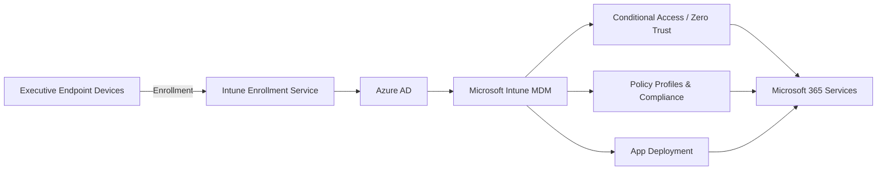
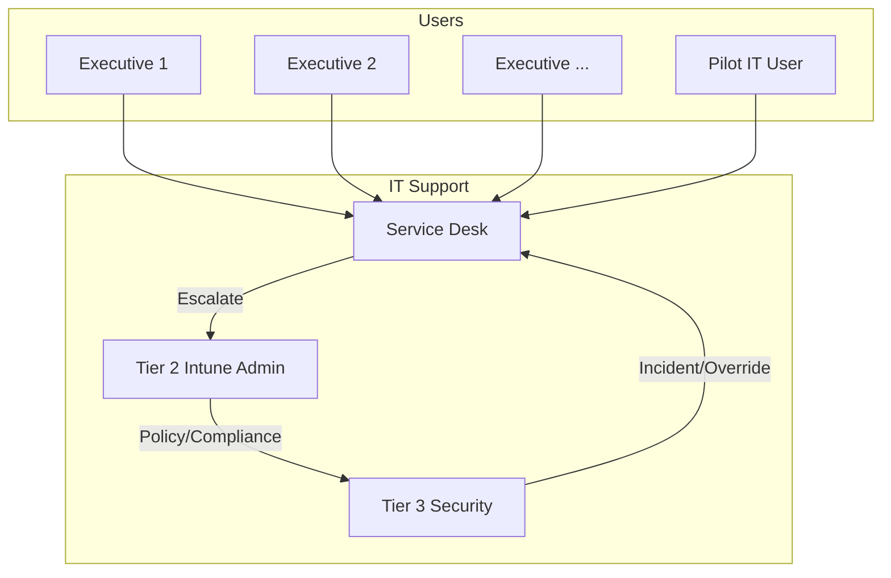

# Intune Implementation Plan for Executive Committee

##### Microsoft Intune Executive Rollout: Implementation Plan

---

#### Executive Summary

The following implementation plan serves as a **comprehensive, step-by-step guide** for deploying Microsoft Intune , starting with a pilot followed by executive users. The rollout is meticulously architected with security, scalability, and operational excellence at its core. The initial focus is a  **pilot involving a small cadre of IT staff** followed by **executive committee members (15–20 users)** , ensuring alignment with both executive needs and best-in-class security practices. This document details  **recommended Intune policy settings for executives, Role-Based Access Control (RBAC), advanced Conditional Access workflows, custom device compliance, onboarding/support documentation, communication planning, and robust monitoring/reporting** . Visual architectural diagrams are included in Mermaid syntax for in-situ documentation. The end goal is a secure, auditable, and scalable Intune deployment, primed for future enterprise-wide expansion.

---

## Table of Contents

1. [Objectives and Guiding Principles](#objectives-and-guiding-principles)
2. Pre-Deployment Readiness & Assessment
3. Architecture Overview with Diagrams
4. RBAC and Executive Group Security Model
5. Device Onboarding, Enrollment, and Autopilot Best Practices
6. Recommended Intune Policies for Executive Users
   * Policy Matrix Table and Explanations
7. Conditional Access & Zero Trust Integration
8. Device Compliance Policies for High-Privilege Accounts
9. Documentation Templates/Examples
   * Onboarding
   * Compliance
   * Support
   * Communication Plan
10. Security Hardening and Advanced Zero Trust
11. Monitoring, Reporting, and Alerting
12. Intune Licensing & Cost Management
13. Scalability Planning and Enterprise Rollout
14. Critical Success Factors and Best Practice Summary

---

## 1. Objectives and Guiding Principles

The **primary objectives**for this phased Intune rollout are as follows:

* **Protect executive-level data and devices** against internal and external threats.
* Ensure **minimal friction and maximum productivity** for executive users.
* Build a **scalable and auditable model** for future organization-wide deployment.
* Establish governance using RBAC, Zero Trust, and Microsoft's recommended security frameworks.
* Create clear, actionable documentation templates to support onboarding, compliance, and incident management.
* Foster communication, readiness, and buy-in across stakeholders.

Adhering to these principles prevents ad hoc policy sprawl and misconfiguration, which are common causes of implementation risk and user dissatisfaction.

---

## 2. Pre-Deployment Readiness & Assessment

**A. Define Clear Business and Security Goals**

* Secure executive access to critical apps (Teams, Outlook, LOB apps).
* Enforce compliance and device health requirements.
* Deploy RBAC to ensure only authorized admins can manage executive devices and policies.

**B. Device and User Inventory**

* Audit existing devices used by executive committee members.
* Identify platforms (Windows, iOS, macOS, Android), OS versions, device ownership.

**C. Licensing Verification**

* Confirm licensing for pilot participants (e.g., Intune Plan 1 as part of Microsoft 365 E3/E5, EM+S, standalone).
* ***NOTE:*** Consider different licensing plans based on organigram for the company-wide roll-out

**D. Stakeholder Alignment & Communication**

* Conduct pre-rollout meetings with executives, IT/security, and support teams.
* Set executive expectations for onboarding, support, and impact.

**E. Policy and Risk Review**

* Review all relevant group policies, local admin accounts, legacy configurations.
* Map out security baselines and compliance controls required by corporate risk team.

**F. Environment Prerequisites**

* Azure AD configuration and group structures.
* Tenant settings for device enrollment restrictions.
* Conditional Access baseline for executives.

**G.  Documentation**

* Leverage Microsoft's downloadable table templates for everything from rollout plans to communication and compliance matrices.
* Create IT documentation using MarkDown
* Diagrams using mermaid and/or Visio

  ---

  ## 3. Architecture Overview with Diagrams

  A visual narrative of the Intune deployment ensures all teams share a common understanding. **Mermaid syntax** is used here for markdown-friendly diagrams but,  for advanced workflows or hybrid scenarios (SCCM Co-Management),  it will be supplemented with Visio diagrams.

  ### A. High-Level Intune Deployment Architecture

This diagram illustrates device flows from enrollment (via Autopilot or manual), device registration with Azure AD, enforcement of MDM policies, app deployment, and Conditional Access controls up to access with M365 services.

### B. Executive Group Management and Support

This diagram models the tiered support process, ensuring executives always have a clear escalation route and support workflow.

 **For hybrid and co-management environments** , supplement with Visio templates from trusted community sources, ensuring up-to-date network and security demarcations
