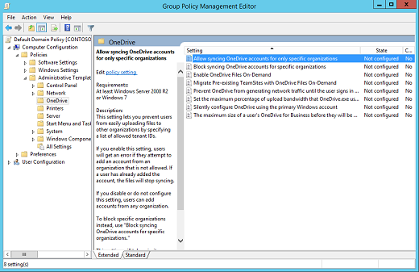
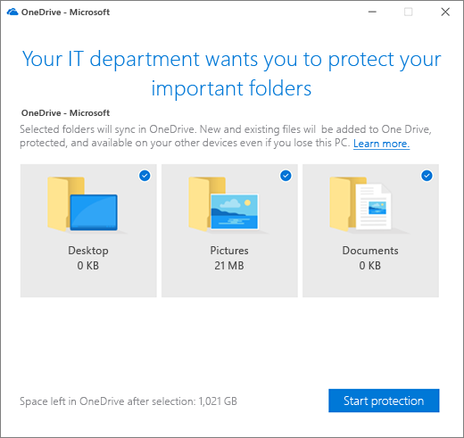
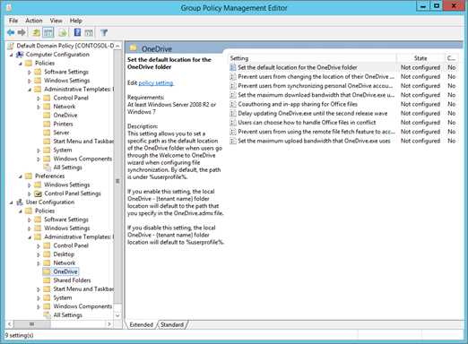
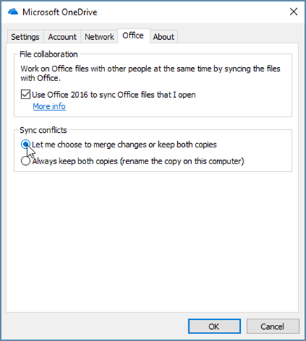
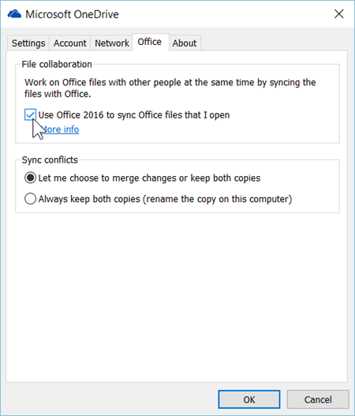

# Group Policy settings for OneDrive for Bussiness in the SIG environment 


### Adendum

>The OneDrive Group Policy objects work by setting registry keys on the computers in your domain.
>
>When you enable or disable a setting, the corresponding registry key is updated on computers in your domain. If you later change the setting back to Not configured, the corresponding registry key is not modified, and the change does not take effect. So after you configure a setting, set it to Enabled or Disabled going forward.
>
>The location where registry keys are written has been updated. When you use the latest files, you might delete registry keys that you set previously.


## Settings inside SIG

### Computer Configuration policies

Computer Configuration policies can be found under 
```
Computer Configuration\Policies\Administrative Templates\OneDrive.
```



#### Allow OneDrive to disable Windows permission inheritance in folders synced read-only

```
Not Enabled - We will guvern permissions through SPO
```


#### Allow syncing OneDrive accounts for only specific organizations - 

>This setting lets you prevent users from easily uploading files to other organizations by specifying a list of allowed tenant IDs.

>If you enable this setting, users will get an error if they attempt to add an account from an organization that is not allowed. If a user has already added the account, the files will stop syncing.

```
Not Enabled - Not required
```

#### Block file downloads when users are low on disk space

```
Enabled - user storage is a concern, 10GB set as limit for alert
```

#### Block syncing OneDrive accounts for specific organizations

>This setting lets you prevent users from easily uploading files to another organization by specifying a list of blocked tenant IDs.

>If you enable this setting, users will get an error if they attempt to add an account from an organization that is blocked. If a user has already added the account, the files will stop syncing.

```
NO - Not required
```

#### Convert synced team site files to online-only files

>This setting lets you convert synced SharePoint files to online-only files when you enable OneDrive Files On-Demand. If you have many PCs syncing the same team site, enabling this setting helps you minimize network traffic and local storage usage.

>If you enable this setting, files in currently syncing team sites will be changed to online-only files by default. Files later added or updated in the team site will also be downloaded as online-only files. To use this setting, the computer must be running Windows 10 Fall Creators Update (version 1709) or later, and OneDrive Files On-Demand must be enabled. This feature is not enabled for on-premises SharePoint sites.

```
Disabled - Internet dependency
```
#### Enable Automatic upload bandwidth management for OneDrive

```
Enabled - OD Client handles network bandwidth usage with LEDBAT
```

#### Limit the sync client upload rate to a percentage of throughput

>This setting lets you balance the performance of different upload tasks on a computer by specifying the percentage of the computer's upload throughput that the OneDrive sync client (OneDrive.exe) can use to upload files. Setting this as a percentage lets the sync client respond to both increases and decreases in throughput. The lower the percentage you set, the slower files will upload. We recommend a value of 50% or higher. The sync client will periodically upload without restriction for one minute and then slow down to the upload percentage you set. This lets small files upload quickly while preventing large uploads from dominating the computer’s upload throughput.

>If you enable this setting and enter a percentage (from 10-99) in the Bandwidth box, computers will use the percentage of upload throughput that you specify when uploading files to OneDrive, and users will not be able to change it.

>If you disable or do not configure this setting, users can choose to limit the upload rate to a fixed value (in KB/second), or set it to "Adjust automatically," which sets the upload rate to 70% of throughput.

```
NO - Set automatically by the setting above
```

#### Prevent the sync client from generating network traffic until users sign in

>This setting lets you block the OneDrive sync client (OneDrive.exe) from generating network traffic (checking for updates, etc.) until users sign in to OneDrive or start syncing files on their computer.

>If you enable this setting, users must sign in to the OneDrive sync client on their computer, or select to sync OneDrive or SharePoint files on the computer, for the sync client to start automatically.

>If you disable or do not configure this setting, the OneDrive sync client will start automatically when users sign in to Windows.

```
NO - Not Required
```


#### Prevent users from fetching files remotely

>This setting lets you block users from using the fetch feature when they’re signed in to the OneDrive sync client (OneDrive.exe) with their personal OneDrive account. The fetch feature lets users go to OneDrive.com, select a Windows computer that's currently online and running the OneDrive sync client, and access all files from that computer. By default, users can use the fetch feature.

>If you enable this setting, users will be prevented from using the fetch feature.

```
NO - Not Required
```

#### Prevent users from moving their Windows known folders to OneDrive

>This setting prevents users from moving their Documents, Pictures, and Desktop folders to any OneDrive for Business account.

>If you enable this setting, users won't be prompted with a window to protect their important folders, and the "Start protection" command will be disabled. If the user has already moved their known folders, the files in those folders will remain in OneDrive. This setting will not take effect if you've enabled "Prompt users to move Windows known folders to OneDrive" or "Silently move Windows known folders to OneDrive."

>If you disable or do not configure this setting, users can choose to move their known folders.

```
Disabled - We want to use Known Files Migration
```

#### Prevent users from redirecting their Windows known folders to their PC

>This setting forces users to keep their Documents, Pictures, and Desktop folders directed to OneDrive.

>If you enable this setting, the "Stop protecting" button in the "Set up protection of important folders" window will be disabled and users will receive an error if they try to stop syncing a known folder.

>If you disable or do not configure this setting, users can choose to redirect their known folders back to their PC.

```
Disabled - We want to use Known Files Migration
```

#### Prevent users from syncing libraries and folders shared from other organizations

```
Enabled - Security concerns regarding users uploading files to other organisations
```

#### Prompt users to move Windows known folders to OneDrive

>This setting displays the following window that prompts users to move their Documents, Pictures, and Desktop folders to OneDrive.



>If you enable this setting and provide your tenant ID, users who are syncing their OneDrive will see the window above when they're signed in. If they close the window, a reminder notification will appear in the activity center until they move all three known folders. If a user has already redirected their known folders to a different OneDrive account, they will be prompted to direct the folders to the account for your organization (leaving existing files behind).

>If you disable or do not configure this setting, the window that prompts users to protect their important folders won't appear.

```
Enabled - this will be enabled in the first stage of the roll-out
```

#### Require users to confirm large delete operations

>This setting makes users confirm that they want to delete files in the cloud when they delete a large number of synced files.

>If you enable this setting, a warning will always appear when users delete a large number of synced files. If a user does not confirm a delete operation within 7 days, the files will not be deleted.

>If you disable or do not configure this setting, users can choose to hide the warning and always delete files in the cloud.

```
Enabled - add an extra security step for data protection
```

#### Set the maximum size of a user's OneDrive that can download automatically

>This setting is used in conjunction with Silently sign in users to the OneDrive sync client with their Windows credentials on devices that don't have OneDrive Files On-Demand enabled. Any user who has a OneDrive that's larger than the specified threshold (in MB) will be prompted to choose the folders they want to sync before the OneDrive sync client (OneDrive.exe) downloads the files.

```
Not set - Not required
```

#### Set the sync client update ring

>We release OneDrive sync client (OneDrive.exe) updates to the public through three rings- first to Insiders, then Production, and finally Enterprise. This setting lets you specify the ring for users in your organization. When you enable this setting and select a ring, users won't be able to change it.

>Insiders ring users will receive builds that let them preview new features coming to OneDrive.

>Production ring users will get the latest features as they become available. This ring is the default.

>Enterprise ring users get new features, bug fixes, and performance improvements last. This ring lets you deploy updates from an internal network location and control the timing of the deployment (within a 60-day window).

>If you disable or do not configure this setting, users can join the Windows Insider program or the Office Insider program to get updates on the Insiders ring.

```
Enterprise ring - 60 days window between updates - same as Office365
```

#### Silently move Windows known folders to OneDrive

>Use this setting to redirect your users' Documents, Pictures, and Desktop folders to OneDrive without any user interaction. This setting is available in the OneDrive sync client build 18.111.0603.0004 or later. Before sync client build 18.171.0823.0001, this setting redirected only empty known folders to OneDrive. Now, it redirects known folders that contain content and moves the content to OneDrive.

>If you enable this setting and provide your tenant ID, you can choose whether to display a notification to users after their folders have been redirected.

>If you disable or do not configure this setting, your users' known folders will not be silently redirected to OneDrive.

```
Will be enabled in the second stage of the roll-out
```

#### Silently sign in users to the OneDrive sync client with their Windows credentials

>If you enable this setting, users who are signed in on a PC that's joined to Azure AD can set up the sync client without entering their account credentials. Users will still be shown OneDrive Setup so they can select folders to sync and change the location of their OneDrive folder. If a user is using the previous OneDrive for Business sync client (Groove.exe), the new sync client will attempt to take over syncing the user's OneDrive from the previous client and preserve the user's sync settings. This setting is frequently used together with Set the maximum size of a user's OneDrive that can download automatically on PCs that don't have Files On-Demand and with Set the default location for the OneDrive folder.

```
Disabled - we don't have Microsoft Live account enabled in order to do this
```

#### Specify SharePoint Server URL and organization name

```
Not set - Not required since we don't use SharePoint on premises
```

#### Specify the OneDrive location in a hybrid environment

```
Not set - Not required since we don't use SharePoint on premises
```

#### Use OneDrive Files On-Demand

>This setting lets you control whether OneDrive Files On-Demand is enabled for your organization. Files On-Demand helps you save storage space on your users' computers and minimize the network impact of sync.

>If you enable this setting, new users who set up the sync client will download online-only files by default. If you disable this setting, Windows 10 users will have the same sync behavior as users of previous versions of Windows, and won't be able to turn on Files On-Demand. If you do not configure this setting, users can turn Files On-Demand on or off.

```
Enabled - filtered by devices that have at least Windows 10 1809
```

#### Warn users who are low on diskspace

```
Enabled - 10GB warning limit
```

#### Prevent users from syncing libraries and folders shared from other organizations

>The B2B Sync feature of the OneDrive sync client allows users at an organization to sync OneDrive for Business and SharePoint libraries and folders shared with them from another organization.

>Enabling this setting will prevent users at your organization from being able to use B2B Sync. Once the setting is enabled (value 1) on a computer, the sync client will not sync libraries and folders shared from other organizations. Modify the setting to the disabled state (value 0) in order to restore B2B Sync capability for your users.

### User Configuration policies

User Configuration policies can be found under
```
User Configuration\Policies\Administrative Templates\OneDrive.
```



#### Allow users to choose how to handle Office file sync conflicts

>This setting specifies what happens when conflicts occur between Office file versions during sync. By default, users can decide if they want to merge changes or keep both copies. Users can also change settings in the OneDrive sync client to always keep both copies. (This option is available for Office 2016 or later only. With earlier versions of Office, both copies are always kept.)

>If you enable this setting, users can decide if they want to merge changes or keep both copies. Users can also configure the sync client to always fork the file and keep both copies as shown below.



```
Enabled
```

#### Continue syncing on metered networks

>This setting lets you turn off the auto-pause feature when devices connect to metered networks.

>If you enable this setting, syncing will continue when devices are on a metered network. OneDrive will not automatically pause syncing.

>If you disable or do not configure this setting, syncing will pause automatically when a metered network is detected and a notification will be displayed. Users can choose not to pause by clicking "Sync Anyway" in the notification. When syncing is paused, users can resume syncing by clicking the OneDrive cloud icon in the notification area of the taskbar and then clicking the alert at the top of the activity center.

```
Disabled - Sync will be paused on a metered connection
```

#### Continue syncing when devices have battery saver mode turned on

>This setting lets you turn off the auto-pause feature for devices that have battery saver mode turned on.

>If you enable this setting, syncing will continue when users turn on battery saver mode. OneDrive will not automatically pause syncing.

>If you disable or do not configure this setting, syncing will pause automatically when battery saver mode is detected and a notification will be displayed. Users can choose not to pause by clicking "Sync Anyway" in the notification. When syncing is paused, users can resume syncing by clicking the OneDrive cloud icon in the notification area of the taskbar and then clicking the alert at the top of the activity center.

```
Disabled - Sync will be paused on low battery
```

#### Coauthor and share in Office desktop apps

>This setting lets multiple users use the Office 365 ProPlus, Office 2019, or Office 2016 desktop apps to simultaneously edit an Office file stored in OneDrive. It also lets users share files from the Office desktop apps.

>If you enable this setting, the Office tab will appear in OneDrive sync settings, and "Use Office 2016 to sync Office files that I open" will be selected by default.



>If you disable this setting, the Office tab is hidden in the sync client, and coauthoring and in-app sharing for Office files is disabled. The Users can choose how to handle Office files in conflict setting will act as disabled and when file conflicts occur, both copies of the file will be kept.

```
Enabled
```

#### Configure team site libraries to sync automatically

>This setting allows you to specify SharePoint team site libraries to sync automatically the next time users sign in to the OneDrive sync client (OneDrive.exe), within an eight-hour window, to help distribute network load. To use this setting, the computer must be running Windows 10 Fall Creators Update (version 1709) or later, and OneDrive Files On-Demand must be enabled. This feature is not enabled for on-premises SharePoint sites.

>If you enable this setting, the OneDrive sync client will automatically sync the contents of the libraries you specified as online-only files the next time the user signs in. The user won't be able to stop syncing the libraries.

>If you disable this setting, team site libraries that you've specified won't be automatically synced for new users. Existing users can choose to stop syncing the libraries, but the libraries won't stop syncing automatically.

```
Not set - User can manually set what to sync
```

#### Disable the tutorial that appears at the end of OneDrive Setup

>This setting lets you prevent the tutorial from launching in a web browser at the end of OneDrive Setup.

>If you enable this setting, users will not see the tutorial after they complete OneDrive Setup.

```
Disabled - we want the initial tutorial to be played
```

#### Limit the sync client download speed to a fixed rate

>This setting lets you configure the maximum speed at which the OneDrive sync client (OneDrive.exe) can download files. This rate is a fixed value in kilobytes per second, and applies only to syncing, not to downloading updates. The lower the rate, the slower the files will download.

>If you enable this setting, enter the rate (from 1 to 100000) in the Bandwidth box. The maximum rate is 100000 KB/s. Any input lower than 50 KB/s will set the limit to 50 KB/s, even if the UI shows a lower value.

>If you disable or do not configure this setting, the download rate is unlimited and users can choose to limit it in OneDrive sync client settings.

```
Not configured - Not required
```

#### Limit the sync client upload speed to a fixed rate

>This setting lets you configure the maximum speed at which the OneDrive sync client (OneDrive.exe) can upload files. This rate is a fixed value in kilobytes per second. The lower the rate, the slower the computer will upload files.

>If you enable this setting and enter the rate (from 1 to 100000) in the Bandwidth box, computers will use the maximum upload rate that you specify, and users will not be able to change it in OneDrive settings. The maximum rate is 100000 KB/s. Any input lower than 50 KB/s will set the limit to 50 KB/s, even if the UI shows a lower value.

>If you disable or do not configure this setting, users can choose to limit the upload rate to a fixed value (in KB/second), or set it to "Adjust automatically" which sets the upload rate to 70% of throughput. 

```
Not configured - Not required
```

#### Prevent users from changing the location of their OneDrive folder

>This setting lets you block users from changing the location of the OneDrive folder on their computer.

>If you enable this setting, the “Change location” link is hidden in OneDrive Setup

```
Enabled - restrict location of OneDrive path
```

#### Prevent users from syncing personal OneDrive accounts

>This setting lets you block users from signing in with a Microsoft account to sync their personal OneDrive files. By default, users are allowed to sync personal OneDrive accounts.

>If you enable this setting, users will be prevented from setting up a sync relationship for their personal OneDrive account. Users who are already syncing their personal OneDrive when you enable this setting won’t be able to continue syncing (and will be shown a message that syncing has stopped), but any files synced to the computer will remain on the computer.

```
Enabled - security converns
```

#### Receive OneDrive sync client updates on the Enterprise ring

>This setting lets you specify the Enterprise ring for users in your organization. We release OneDrive sync client (OneDrive.exe) updates to the public through three rings— first to Insiders, then Production, and finally Enterprise.

>Selecting the Enterprise ring gives you some extra time to prepare for updates, but means users will need to wait to receive the latest improvements. The Enterprise ring also lets you deploy updates from an internal network location on your own schedule.

#### Set the default location for the OneDrive folder

>This setting lets you set a specific path as the default location of the OneDrive folder on users' computers. By default, the path is under %userprofile%.

>If you enable this setting, the default location of the OneDrive - {organization name} folder will be the path that you specify.

>If you disable this setting, the local OneDrive - {organization name} folder location will default to %userprofile%.

```
Not configured - Not required
```